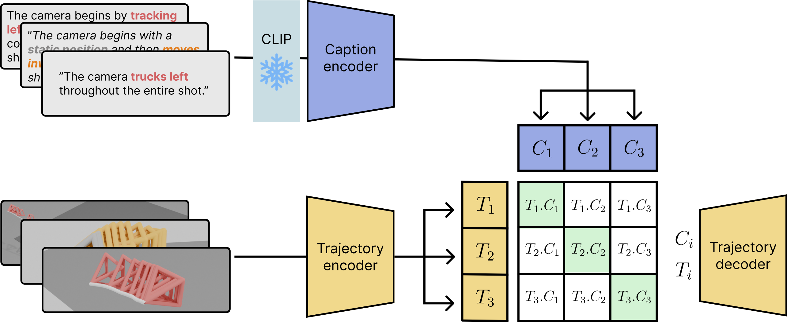

<div align="center">

# E.T. the Exceptional Trajectories
## CLaTr

<a href="https://robincourant.github.io/info/"><strong>Robin Courant</strong></a>
·
<a href="https://nicolas-dufour.github.io/"><strong>Nicolas Dufour</strong></a>
·
<a href="https://triocrossing.github.io/"><strong>Xi Wang</strong></a>
·
<a href="http://people.irisa.fr/Marc.Christie/"><strong>Marc Christie</strong></a>
·
<a href="https://vicky.kalogeiton.info/"><strong>Vicky Kalogeiton</strong></a>

[]()

</div>


<div align="center">
    <a href="https://www.lix.polytechnique.fr/vista/projects/2024_et_courant/" class="button"><b>[Webpage]</b></a> &nbsp;&nbsp;&nbsp;&nbsp;
    <a href="https://huggingface.co/spaces/robin-courant/DIRECTOR-demo" class="button"><b>[Demo]</b></a> &nbsp;&nbsp;&nbsp;&nbsp;
    <a href="https://github.com/robincourant/DIRECTOR" class="button"><b>[DIRECTOR]</b></a> &nbsp;&nbsp;&nbsp;&nbsp;
    <a href="https://github.com/robincourant/the-exceptional-trajectories" class="button"><b>[Data]</b></a> &nbsp;&nbsp;&nbsp;&nbsp;
</div>

<br/>



---

## Getting started

<details><summary>Create environment</summary>
&emsp;

Create conda environment:
```
conda create --name clatr python=3.10 -y
conda activate clatr
```

Install dependencies:
```
conda install pytorch pytorch-cuda=12.1 -c pytorch -c nvidia
pip install -r requirements.txt
```
</details>
<br>

<details><summary>Set up the dataset</summary>
&emsp;

Check the data repository [here](https://huggingface.co/datasets/robin-courant/et-data).

First, install `git lfs` by following the instructions [here](https://docs.github.com/en/repositories/working-with-files/managing-large-files/installing-git-large-file-storage).


To get the data, run:
```
cd /PATH/TO/THE/DATASET
git clone https://huggingface.co/datasets/robin-courant/et-data
```

Prepare the dataset (untar archives):
```
cd et-data
sh untar_and_move.sh
```

Then copy or symlink the `et-data` folder in `./data`:
```
cd /PATH/TO/CLaTr
ln -s /PATH/TO/THE/DATASET/et-data ./data
```
</details>
<br>

<details><summary>Download checkpoints</summary>
&emsp;

Run:
```
sh download_checkpoints.sh
```
</details>
<br>

## Usage

Launch training:
```
HYDRA_FULL_ERROR=1 python src/train.py
```

Launch evaluation:
```
HYDRA_FULL_ERROR=1 python src/evaluate.py checkpoint_path=checkpoints/clatr-e100.ckpt
```

Launch feature extraction:
```
HYDRA_FULL_ERROR=1 python src/extraction.py checkpoint_path=checkpoints/clatr-e100.ckpt
```

Extract checkpoint into submodule checkpoints (`traj_encoder`, `text_encoder`, `traj_decoder`):
```
HYDRA_FULL_ERROR=1 python src/extract_ckpt.py checkpoint_path=checkpoints/clatr-e100.ckpt
```

## License
This code is distributed under an [MIT LICENSE](LICENSE).

Note that our code depends on other libraries, including PyTorch, PyTorch3D, Hugging Face, Hydra, and uses datasets which each have their own respective licenses that must also be followed.

Note also that this repository is highly adapted from the codebase of [TMR](https://github.com/Mathux/TMR) by [Mathis Petrovich](https://mathis.petrovich.fr/).
